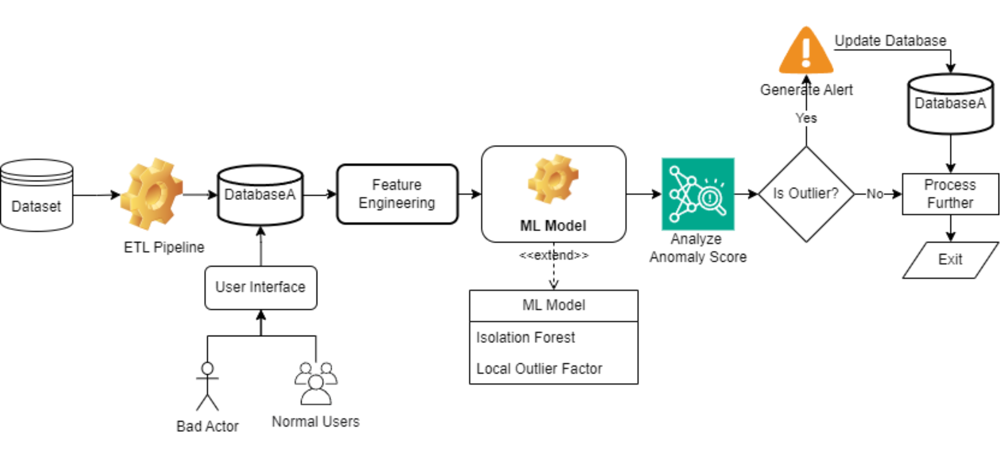
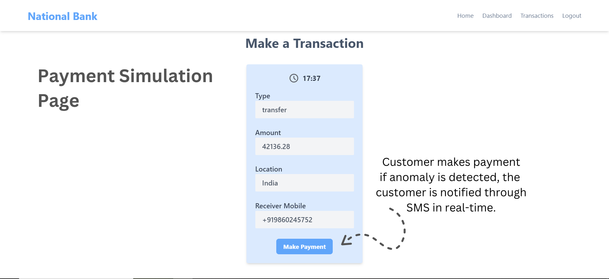
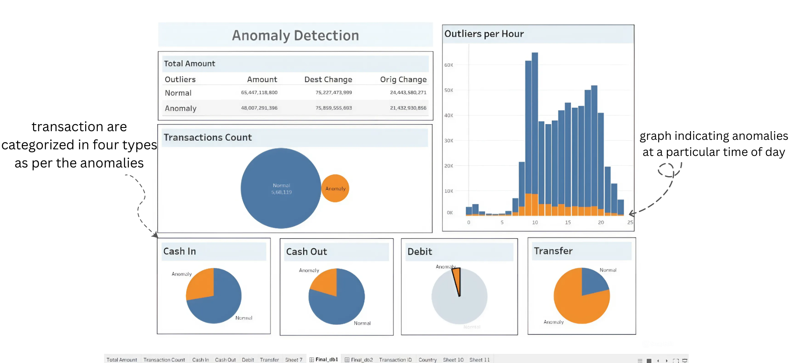
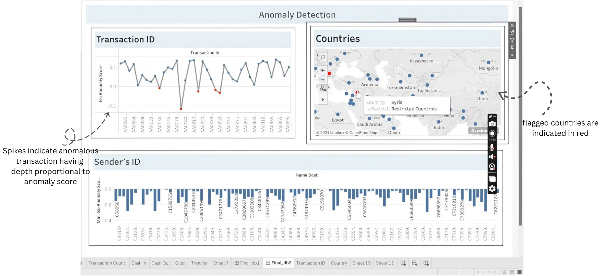
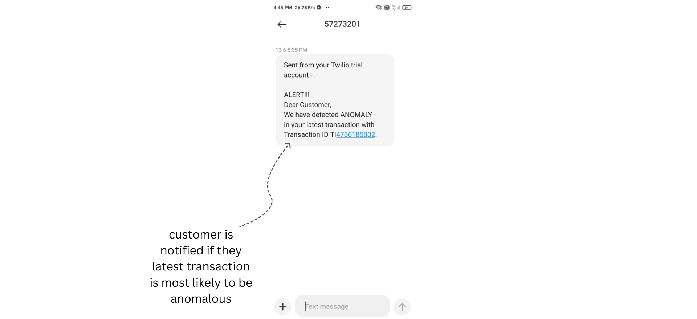

<p align="center">
  <a href="" rel="noopener">
 </a>
</p>

<h3 align="center">FinWatch</h3>

<div align="center">

  []() 
  [](https://github.com/piyush960/FinWatch/issues)
  [](https://github.com/piyush960/FinWatch/pulls)

</div>

---

<p align="center"> A machine learning-based anomaly detection system designed to identify anomalous transactions in consumer banking and financial activities.
    <br> 
</p>

### 📝 Table of Contents
- [About](#about)
- [Flowchart](#flowchart)
- [Getting Started](#getting_started)
- [Video Demo](#demo)
- [Usage](#usage)
- [Built Using](#built_using)
- [Authors](#authors)

### 📕 About <a name = "about"></a>
A machine learning-based anomaly detection system designed to identify anomalous transactions in consumer banking and financial activities. The system leverages advanced algorithms to analyze various transaction patterns such as amount changes, transaction types, time of day, and location, detecting deviations that may indicate suspicious activities and notifies the user in realtime through SMS.

This system has been tested on a dataset with 0.6 million rows and is scalable to work with larger datasets. It also includes a feature to list countries that are restricted or flagged for transactions. Additionally, the system utilizes Tableau for data analysis and visualization, displaying anomalous transaction IDs on a scale.

### 📊 Flowchart <a name = "flowchart"></a>



### 🏁 Getting Started <a name = "getting_started"></a>
These instructions will get you a copy of the project up and running on your local machine.

#### Prerequisites
The following TechStack is required to be install on your machine.
1. Python (Anaconda Navigator)
2. NPM
3. Node.js
4. Tableau

#### Installing
1. Clone the repository.

2. Setting up Python env in [flask](./flask/) directory.
``` shell
python -m venv venv

source venv/bin/activate

pip install -r requirements.txt

flask run
```

3. Setting up the React App in [admin dashboard](./admin%20dashboard/) directory.
``` shell
npm install 

npm run dev
```

4. Get your dataset, open jupyter using anaconda and select the [notebook](./notebook/)

5. Setup Tableau Book
``` shell
In Tableau Desktop, go to the File menu.

Select Open....

Browse to the location of the tableau_dashboard.twb file and select it.

Click Open to load the workbook.
```

### ▶️ Video Demo <a name = "demo"></a>
See the demo of the system running by clicking [here](https://drive.google.com/file/d/1b4Ho3t4lNqPouC1mzqGA30q8dm_oIiN8/view?usp=sharing)

### 💻 Usage <a name="usage"></a>
1. Payment Simulation Page


2. Tableau Sheet 1


3. Tableau Sheet 2


4. SMS Notification



### ⛏️ Built Using <a name = "built_using"></a>
- [PostgreSQL](https://www.postgresql.org/) - Database
- [ReactJs](https://vuejs.org/) - Web Framework
- [NodeJs](https://nodejs.org/en/) - Server Environment
- [Flask](https://expressjs.com/) - Server Framework
- [Pandas](https://pandas.pydata.org/) - Data Manipulation Tool
- [Numpy](https://numpy.org/) - Numerical Python Library
- [Scikit-learn](https://scikit-learn.org/) - Machine Learning Library
- [Tableau](https://www.tableau.com/) - Data Visualization Tool
- [Twilio](https://www.twilio.com/en-us) - Communication API


### ✍️ Authors <a name = "authors"></a>
- [Piyush Dahake](https://github.com/piyush960)
- [Mansi Apet](https://github.com/mansi-ui)
- [Prasad Chaudhari](https://github.com/prasadac07)
- [Arinjay Patil](https://github.com/arinjay-04)
